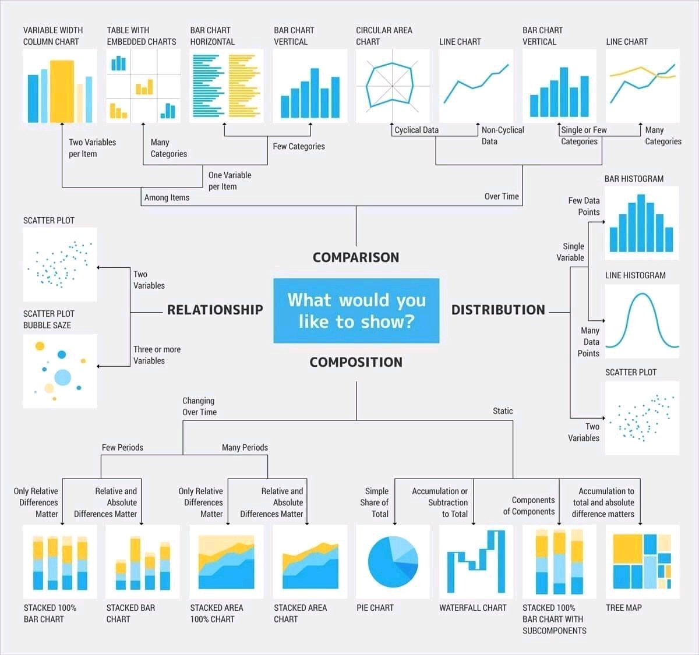
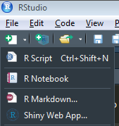
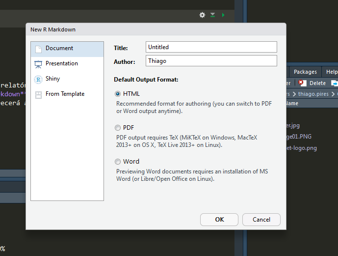
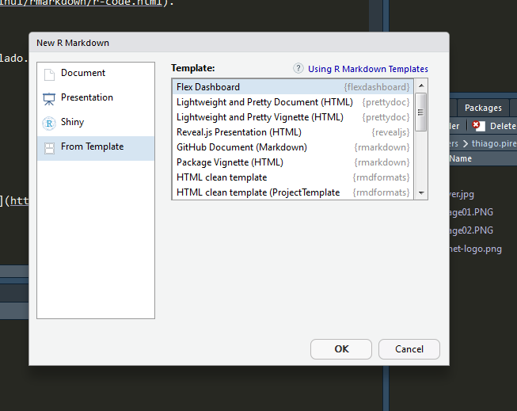
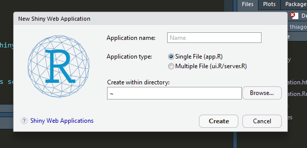

```{r setup, include=FALSE}
knitr::opts_chunk$set(message = FALSE, warning = FALSE, fig.align = "center")
```

# Visualização de dados {data-background=#9292e8}

## Visualização de dados

<p align="justify">
*"A visualização de dados consiste na representação gráfica de informações e dados. Usando elementos visuais, como diagramas, gráficos e mapas."*
</p>

[www.tableau.com](https://www.tableau.com/pt-br/learn/articles/data-visualization)

## Tipos de gráficos

<center>{width=60%}</center>

## Pacotes

Alguns pacotes para visualização de dados no R:

>- `library(graphics)`
>- `library(ggplot2)`
>- `library(plotly)`
>- `library(leaflet)`
>- `library(DT)`
>- `library(crosstalk)`
>- `library(flexdashboard)`
>- `library(shiny)`

## Tipos de variáveis

Conhecer os tipos de variáveis é importante para saber que tipo de gráfico deve ser utilizado.

```{r}

library(dplyr)
library(randomNames)
library(lubridate)

# conjunto de dados produzidos artificialmente
set.seed(1233)
dados <- tibble(Sexo = factor(rbinom(100, 1, .5), labels = c("Female", "Male")),
                Ano = runif(100, 1950, 2010) %>% trunc(),
                Nome = randomNames(gender = Sexo, ethnicity = "Hispanic", which.names = "first"),
                Idade = (year(Sys.Date()) - Ano) %>% trunc(),
                Doente = factor(rbinom(100, 1, .5), labels = c("Sim", "Não")))

dados %>% glimpse()

```

# library(graphics) {data-background=#64A94B}

## plot()

```{r fig.height=4, fig.width=6}

set.seed(10) # fixando a semente
x <- 1:10
y <- rnorm(10)

plot(x, y, col = "blue") # cores disponíveis em colours()

```

## Cores

```{r}

colours() %>% length()
colours()[1:30]

```

Uma lista de cores no formato hexadecimal poderá ser encontrado em <https://www.w3schools.com/colors/colors_picker.asp>


## plot()

```{r fig.height=4, fig.width=6}

set.seed(10)
x <- 1:10
y <- rnorm(10)

plot(x, y, col = "blue", type = "l", xlab = "Tempo", ylab = "Taxa")

```

## points()

```{r fig.height=3, fig.width=6}

set.seed(10)
x <- 1:10
y <- rnorm(10)
z <- rnorm(10)

plot(x, y, col = "blue", type = "l", xlab = "Tempo", ylab = "Taxa")
points(x, z, col = "red", type = "b") # adicionando uma série de dados

```

## ylim

```{r fig.height=3, fig.width=6}

set.seed(10)
x <- 1:10
y <- rnorm(10)
z <- rnorm(10)

plot(x, y, col = "blue", type = "l", xlab = "Tempo", ylab = "Taxa", 
     ylim = range(c(y, z))) # definindo os limites do eixo y
points(x, z, col = "red", type = "b")

```

## types

```{r fig.height=4, fig.width=6}

set.seed(34)

par(mfrow = c(2, 2))
plot(rnorm(10), type = "l", main = "type = 'l'")
plot(rnorm(10), type = "p", main = "type = 'p'")
plot(rnorm(10), type = "b", main = "type = 'b'")
plot(rnorm(10), type = "s", main = "type = 's'")

```

## lty

```{r fig.height=3, fig.width=6}

set.seed(34)

plot(runif(10), type = "l", lty = 1, ylim = c(0, 1)) # variando o lty de 1 à 4
points(runif(10), type = "l", lty = 2, col = "red")
points(runif(10), type = "l", lty = 3, col = "blue")
points(runif(10), type = "l", lty = 4, col = "tomato")
legend(8, 1, c("lty = 1", "lty = 2", "lty = 3", "lty = 4"), lty = 1:4, # inserindo legenda
       col = c("black", "red", "blue", "tomato"))

```

## pch e grid()

```{r fig.height=4, fig.width=6}

set.seed(34)

plot(runif(10), type = "b", col = "blue", pch = 19, # inserindo pch diferentes
     panel.first = {grid(lty = 1)}, ylim = c(0, 1)) # inserindo grid()
points(runif(10), type = "b", col = "red", pch = 17)
legend(7.9, 1, c("pch = 19", "pch = 17"), 
       col = c("blue", "red"), pch = c(19, 17))

```

## lwd

```{r fig.height=4, fig.width=6}

set.seed(34)

plot(runif(10), type = "l", col = "blue", lwd = 2,
     panel.first = {grid(lty = 1)}, ylim = c(0, 1))
points(runif(10), type = "b", col = "red", lwd = 4)
legend(7.8, 1, c("lwd = 2", "lwd = 4"), 
       col = c("blue", "red"), lwd = c(2, 4))

```

## curve()

```{r fig.height=4, fig.width=6}

f <- function(x) (x - 3)*(x - 2)

curve(f, -2, 4, col = "blue")

```

## curve(axes = FALSE)

```{r fig.height=4, fig.width=6}

f <- function(x) (x - 3)*(x - 2)

curve(f, -2, 4, col = "blue", axes = FALSE)
axis(1, pos = 0)
axis(2, las = 1, pos = 0, at = c(-Inf, seq(5, 20, 5)))

points(c(2, 3), c(0, 0), col = "blue", pch = 19)


```

## curve(add = TRUE)

```{r fig.height=3.2, fig.width=6}

f <- function(x) exp(x)
g <- function(x) -x^2 + 10

curve(f, -4, 3, col = "blue", axes = FALSE, lwd = 3, 
      panel.first = {grid(lty = 1)}, ylab = "y")
curve(g, col = "tomato", add = TRUE, lwd = 3)
axis(1, pos = 0)
axis(2, las = 1, pos = 0, at = c(-Inf, seq(5, 20, 5)))
legend(-4, 20, c("f", "g"), col = c("blue", "tomato"), lwd = 3)

```

## abline

```{r fig.height=4, fig.width=6}

f <- function(x) 10 + 1/x

curve(f, -1, 1, col = "blue", axes = FALSE, lwd = 3)
axis(1, pos = 0, at = c(-1, -.5, .5, 1))
axis(2, las = 1, pos = 0)

abline(h = 10, lty = 2, col = "tomato", lwd = 3) # adicionando uma linha vertical

```

## hist()

```{r fig.height=4, fig.width=6}

set.seed(35)
x <- rnorm(100)

hist(x, main = "Histograma", col = "red", border = FALSE)

```

## pie()

```{r fig.height=4, fig.width=6}

x <- c(21, 62, 10, 53)
labels <- c("London", "New York", "Singapore", "Mumbai")

pie(x, labels, border = FALSE)

```

## Exercícios

- Mostre a relação entre `Time` e `demand` utilizando a base de dados `BOD`.

- Faça um gráfico utilizando as funções `sin` (seno) e `cos` (cosseno) onde o domínio de $x$ é: $-5 \leq x \leq 5$.

- Faça um histograma com os dados do banco de dados `WWWusage`.

# library(ggplot2) {data-background=#ffa31a}

## Titanic

```{r}

library(titanic)

titanic_train %>% 
  glimpse() # informações sobre o banco de dados

```

## ggplot() + geom_bar()

```{r fig.height=4, fig.width=6}

library(ggplot2)

titanic_train %>% 
  ggplot(aes(Survived)) + geom_bar()

```

## ggplot() + geom_bar()

```{r fig.height=4, fig.width=6}

titanic_train %>% 
  ggplot(aes(as.factor(Survived), 
             (..count../sum(..count..)))) + # neste argumento se calcula a proporção
  geom_bar() +
  scale_x_discrete(labels = c("Não", "Sim")) + # define as categorias no eixo x
  scale_y_continuous(labels = scales::percent) + # apresenta o eixo y em percentual
  labs(x = "Sobrevivente", y = "Percentual") # rótulo dos eixos x e y

```

## ggplot() + geom_bar()

```{r fig.height=4, fig.width=6}

titanic_train %>% 
  ggplot(aes(as.factor(Survived), (..count../sum(..count..)))) + 
  geom_bar(fill = "#b30000", alpha = .6) + # altera a cor e opacidade
  scale_x_discrete(labels = c("Não", "Sim")) +
  scale_y_continuous(labels = scales::percent) +
  labs(x = "Sobrevivente", y = "Percentual") +
  theme_minimal() # mudança de tema

```

## ggplot() + geom_bar()

```{r fig.height=3, fig.width=6}

titanic_train %>% 
  ggplot(aes(as.factor(Survived), (..count../sum(..count..)),
             fill = Sex)) + # preenchimento da barra segundo sexo
  geom_bar(alpha = .8, position = "fill") + # position = "fill" a barra é empilhada preenchendo 100%
  scale_x_discrete(labels = c("Não", "Sim")) +
  scale_y_continuous(labels = scales::percent) +
  labs(x = "Sobrevivente", y = "Percentual", fill = "Sexo") + # o argumento 'fill' altera o título da legenda
  theme_minimal()

```

## scale_fill_brewer()

```{r fig.height=3, fig.width=6}

titanic_train %>% 
  ggplot(aes(as.factor(Survived), (..count../sum(..count..)),
             fill = Sex)) + # preenchimento da barra segundo sexo
  geom_bar(alpha = .8, position = "fill") + # position = "fill" a barra é empilhada preenchendo 100%
  scale_x_discrete(labels = c("Não", "Sim")) +
  scale_y_continuous(labels = scales::percent) +
  scale_fill_brewer("Sexo", palette = "Greens") + # alterar as cores
  labs(x = "Sobrevivente", y = "Percentual", fill = "Sexo") + # o argumento 'fill' altera o título da legenda
  theme_minimal()

```

## Lista de paletas

```{r fig.height=5}

RColorBrewer::display.brewer.all(colorblindFriendly = TRUE)

```

## scale_fill_manual()

```{r fig.height=3, fig.width=6}

titanic_train %>% 
  ggplot(aes(as.factor(Survived), (..count../sum(..count..)),
             fill = Sex)) + # preenchimento da barra segundo sexo
  geom_bar(alpha = .8, position = "fill") + # position = "fill" a barra é empilhada preenchendo 100%
  scale_x_discrete(labels = c("Não", "Sim")) +
  scale_y_continuous(labels = scales::percent) +
  scale_fill_manual("Sexo", values = c("female" = "black", "male" = "orange")) + # alterar as cores
  labs(x = "Sobrevivente", y = "Percentual") + # o argumento 'fill' altera o título da legenda
  theme_minimal()

```

## ggplot() + geom_bar() + facet_grid()

```{r fig.height=3, fig.width=6}

titanic_train %>% 
  ggplot(aes(as.factor(Survived), (..count../sum(..count..)),
             fill = Sex)) +
  geom_bar(alpha = .8, position = "fill") + 
  facet_grid(~ Pclass) + # introdução de uma terceira variável na análise
  scale_x_discrete(labels = c("Não", "Sim")) +
  scale_y_continuous(labels = scales::percent) +
  scale_fill_manual("Sexo", values = c("female" = "black", "male" = "orange")) + # alterar as cores
  labs(x = "Sobrevivente", y = "Percentual", fill = "Sexo") +
  theme_light() # seleção de um outro tema

```

## ggplot() + geom_boxplot()

```{r fig.height=4, fig.width=6}

titanic_train %>% 
  ggplot(aes(y = Age)) + geom_boxplot() # é necessário definir o y

```

## ggplot() + geom_boxplot()

```{r fig.height=4, fig.width=6}

titanic_train %>% 
  ggplot(aes(as.factor(Survived), Age)) + geom_boxplot() + # distribuição da variável y segundo a variável x
  scale_x_discrete(labels = c("Não", "Sim")) +
  labs(x = "Sobrevivente", y = "Idade")

```

## ggplot() + geom_boxplot()

```{r fig.height=4, fig.width=6}

titanic_train %>% 
  ggplot(aes(as.factor(Survived), Age, fill = Sex)) + geom_boxplot() +
  scale_x_discrete(labels = c("Não", "Sim")) +
  labs(x = "Sobrevivente", y = "Idade", fill = "Sexo")

```

## ggplot() + geom_boxplot() + facet_grid()

```{r fig.height=4, fig.width=6}

titanic_train %>% 
  ggplot(aes(as.factor(Survived), Age)) + geom_boxplot() +
  facet_grid(. ~ Sex) +
  scale_x_discrete(labels = c("Não", "Sim")) +
  labs(x = "Sobrevivente", y = "Idade")

```

## ggplot() + geom_boxplot() + facet_grid()

```{r fig.height=4, fig.width=6}

titanic_train %>% 
  ggplot(aes(as.factor(Survived), Age, fill = Sex)) + geom_boxplot() +
  facet_grid(. ~ Pclass) +
  scale_x_discrete(labels = c("Não", "Sim")) +
  labs(x = "Sobrevivente", y = "Idade", fill = "Sexo")

```

## Google Trends: Dengue

```{r}

library(gtrendsR)

dengue <- gtrends("dengue", geo = "BR", time = "2018-01-01 2018-12-15")

dengue$interest_over_time %>%
  glimpse()

```

## ggplot() + geom_line()

```{r fig.height=4, fig.width=6}

dengue$interest_over_time %>% 
  ggplot(aes(date, hits)) + geom_line()

```

## Google Trends: Times de futebol

```{r}

times <- gtrends(c("Palmeiras", "Flamengo"), geo = "BR", time = "2018-04-14 2018-12-02")

times$interest_over_time %>%
  glimpse()

```

## ggplot() + geom_line()

```{r fig.height=4, fig.width=6}

times$interest_over_time %>% 
  ggplot(aes(date, hits, colour = keyword)) + geom_line()

```

## ggplot() + geom_line()

```{r fig.height=4, fig.width=6}

(g1 <- times$interest_over_time %>% 
  mutate(semanas = week(date)) %>% # criando a variável semana
  group_by(semanas, keyword) %>% # agregando segundo semanas e times
  summarise(hits = mean(hits)) %>% # agregando com a média
  ggplot(aes(semanas, hits, colour = keyword)) + geom_line(size = 1) +
   scale_color_brewer("Times", palette = "Dark2") +
   labs(x = "Semanas", y = "Hits"))

```

## geom_rect() + geom_text()

```{r fig.height=4, fig.width=6}

g1 + geom_rect(aes(xmin = week("2018-06-14"), # início do período
                   xmax = week("2018-07-15"), # fim do período
                   ymin = -Inf, ymax = Inf), 
               fill = "#b3ff99", colour = "#ffffff", alpha = .006) +
  geom_text(aes(26, 20, label = "Copa do mundo"), # texto inserido
            angle = 90, show_guide  = FALSE) 

```

## geom_text()

```{r fig.height=4, fig.width=6}

titanic_train %>% 
  group_by(Survived) %>% 
  summarise(n = n()) %>% 
  mutate(perc = n/sum(n) * 100) %>% 
  ggplot(aes(x = as.factor(Survived), y = perc)) + geom_col() +
  geom_text(aes(label = perc %>% round(1)), 
            vjust = 1.5, color = "white", size = 10) # vjust altera a posição vertical do texto

```

## Exercícios

- Gráfico de linhas relacionando faixa etária e taxa de mortalidade do banco `VADeaths`. (Dica: utilize `VADeaths %>% reshape2::melt()`).

- Gráfico de barras utilizando o banco `titanic::titanic_train` com a  variável `Embarked`.

- Usar o mesmo banco anterior analisando o número de sobreviventes segundo o porto de embarcação.

- Analisar com o google trends (`gtrendsR`) como o termo *Lula* se distribui de 01-01-2018 à 31-08-2018. Os picos descrevem eventos importantes?

# library(wordcloud) {data-background=#ffa31a}

## Núvem de palavras

A nuvem de palavras é uma técnica que permite realçar as palavras usadas com mais frequência em um texto.

## wordcloud()

```{r}

library(wordcloud)
library(gtrendsR)
library(magrittr)
library(RColorBrewer)

dengue <- gtrends("dengue", geo = "BR", time = "2018-01-01 2018-12-15")
related <- dengue$related_queries %>% 
  filter(related_queries == "top") %>% 
  select(subject, value) %>% 
  mutate(value = iconv(value, from = "utf-8", to = "iso8859-1"))

```

## wordcloud()

```{r fig.height=5, fig.width=5}

wordcloud(words = related %>% pull(value), freq = related %>% pull(subject) %>% as.numeric,
          colors = brewer.pal(6, "Dark2"), random.order = FALSE)

```

## ggwordcloud

```{r}

empresas <- gtrends(c("Microsoft", "Google"), time = "2019-01-01 2019-05-27")
related <- empresas$related_queries %>% 
  filter(related_queries == "top") %>% 
  select(subject, value, keyword) %>% 
  mutate(value = iconv(value, from = "utf-8", to = "iso8859-1"))

require(ggwordcloud)

wc <- related %>% 
  ggplot(aes(label = value, size = subject %>% as.numeric(), colour = subject %>% as.numeric())) +
  geom_text_wordcloud_area(shape = "square") +
  scale_size_area(max_size = 13) +
  theme_minimal() +
  scale_color_gradient(low = "gray", high = "springgreen3") +
  facet_wrap(~keyword)

```

## ggwordcloud

```{r echo = FALSE}

wc

```

# library(sp) {data-background=#ff8080}

## Mapa de área

```{r}

require(rgdal)
require(sp)
require(RColorBrewer)
require(dplyr)
require(magrittr)

shape <- readOGR("./data/BRUFE250GC_SIR", "BRUFE250GC_SIR",
                 verbose = FALSE,
                 stringsAsFactors = FALSE,
                 encoding = "utf-8",
                 use_iconv = TRUE)

shape@data %>% as_tibble()

```

## Mapa de área

```{r fig.height=5, fig.width=5}

plot(shape)

```

## Mapa de área

```{r}

set.seed(1057)
dados <- tibble(CD_GEOCUF = c(43, 42, 41, 35, 31, 33, 32, 29, 28,
                              26, 25, 24, 27, 23, 22, 21, 15, 13,
                              16, 11, 14, 12, 51, 50, 53, 52, 17),
                y = rnorm(27)) %>% 
  mutate(CD_GEOCUF = CD_GEOCUF %>% as.character(),
         y = cut(y, 4))

shape@data %<>% left_join(dados, by = "CD_GEOCUF") 
shape@data %>% as_tibble()

```

## Mapa de área

```{r fig.height=5, fig.width=5}

shape %>% spplot(zcol = "y", # variável de análise
                 col.regions = brewer.pal(n = 4, name = "OrRd"), # paleta de cores
                 col = "transparent", # cor das fronteiras
                 par.settings = list(axis.line = list(col = 'transparent')) # sem frame
                 )

```

# library(plotly) {data-background=#ff8080}

## ggplotly()

<center>
```{r fig.height=3, fig.width=6}

library(plotly)
library(glue)

g2 <- titanic_train %>% 
  group_by(Survived, Sex) %>% summarise(n = n()) %>% 
  group_by(Survived) %>% mutate(perc = n/sum(n)) %>%
  ggplot(aes(as.factor(Survived), weight = perc, fill = Sex, 
             text = glue("{Sex} <br> {(perc * 100) %>% round(2)}%"))) + 
  geom_bar(alpha = .6, position = "fill") +
  scale_x_discrete(labels = c("Não", "Sim")) +
  scale_y_continuous(labels = scales::percent) +
  labs(x = "Sobrevivente", y = "Percentual", fill = "") + theme_minimal()
ggplotly(g2, tooltip = "text") %>% config(displayModeBar = FALSE) %>% layout(hovermode = TRUE)

```
</center>

## plot_ly()

<center>
```{r fig.height=4, fig.width=6}

titanic_train %>% 
  plot_ly(x = ~factor(Survived, labels = c("Não", "Sim"))) %>% 
  layout(xaxis = list(title = "Sobrevivente"))

```
</center>

## plot_ly()

<center>
```{r fig.height=4, fig.width=6}

titanic_train %>% 
  group_by(Survived) %>% 
  summarise(n = n()) %>% 
  mutate(perc = n/sum(n) * 100) %>% 
  plot_ly(x = ~factor(Survived, labels = c("Não", "Sim")), y = ~perc) %>% 
  layout(xaxis = list(title = "Sobrevivente"),
         yaxis = list(title = "%"))

```
</center>

## plot_ly()

<center>
```{r fig.height=4, fig.width=6}

titanic_train %>% 
  group_by(Survived, Sex) %>% summarise(n = n()) %>% 
  group_by(Survived) %>% mutate(perc = (n/sum(n) * 100) %>% round(2)) %>% 
  plot_ly(x = ~factor(Survived, labels = c("Não", "Sim")), 
          y = ~perc, color = ~Sex) %>% 
  layout(xaxis = list(title = "Sobrevivente"),
         yaxis = list(title = "%"))

```
</center>

## plot_ly()

<center>
```{r fig.height=3.8, fig.width=6}

titanic_train %>% 
  group_by(Survived, Sex) %>% summarise(n = n()) %>% 
  group_by(Survived) %>% mutate(perc = (n/sum(n) * 100) %>% round(2)) %>% 
  plot_ly(x = ~factor(Survived, labels = c("Não", "Sim")), 
          y = ~perc, color = ~Sex, opacity = .75,
          text = ~perc, textposition = "outside", # inserindo rótulo (auto/outside)
          colors = c("#47476b", "#a3a3c2")) %>% # alterando cores
  layout(xaxis = list(title = "Sobrevivente"),
         yaxis = list(title = "%"))

```
</center>

## plot_ly()

<center>
```{r fig.height=3.5, fig.width=6}

titanic_train %>% 
  group_by(Survived, Sex) %>% summarise(n = n()) %>% 
  group_by(Survived) %>% mutate(perc = (n/sum(n) * 100) %>% round(2)) %>% 
  plot_ly(x = ~factor(Survived, labels = c("Não", "Sim")), 
          y = ~perc, color = ~Sex) %>% 
  layout(xaxis = list(title = "Sobrevivente"),
         yaxis = list(title = "%"),
         barmode = "stack") %>% # barras empilhadas
  config(displayModeBar = FALSE)

```
</center>

## plot_ly(type = pie)

<center>
```{r fig.height=4, fig.width=6}

titanic_train %>% 
  group_by(Survived) %>% 
  summarise(n = n()) %>% 
  mutate(perc = n/sum(n) * 100) %>% 
  plot_ly(labels = ~factor(Survived, labels = c("Não sobreviveu", "Sobreviveu")), 
          values = ~perc, type = "pie", # gráfico de setores
          textinfo = "percent",
          hoverinfo = "percent+label") %>%
  layout(showlegend = T, font = list(size = 14)) # mostrar legenda e alterar tamanho da fonte

```
</center>

## Instituto de Segurança Pública

<center>
```{r}

read.csv2("data/BaseEstadoTaxaMes.csv") %>% # lendo arquivo .csv
  select(1:15) %>% 
  glimpse()

```
</center>

## plot_ly(mode = line)

<center>
```{r fig.height=4, fig.width=6}

read.csv2("data/BaseEstadoTaxaMes.csv") %>% 
  mutate(date = glue("{vano}-{mes}") %>% ymd(truncated = 1)) %>% 
  select(date, hom_doloso) %>%
  plot_ly(x = ~date, y = ~hom_doloso, mode = "line+markers") %>% # gráfico de linha
  layout(title = "Taxa de homicídio doloso no estado do RJ", 
         xaxis = list(title = "Data"),
         yaxis = list(title = "Taxa por 100 mil hab.")) %>% 
  rangeslider() # controlar janela de visualização

```
</center>

## add_trace()

<center>
```{r fig.height=3.5, fig.width=6}

read.csv2("data/BaseEstadoTaxaMes.csv") %>% 
  mutate(date = glue("{vano}-{mes}") %>% ymd(truncated = 1)) %>% # criando variável data com ano e mês
  select(date, hom_doloso, hom_culposo) %>%
  plot_ly(x = ~date) %>% 
  add_trace(y = ~hom_doloso, name = "Doloso", mode = "lines") %>% # adicionando série
  add_trace(y = ~hom_culposo, name = "Culposo", mode = "lines") %>% # adicionando série
  layout(title = "Taxa de homicídio no estado do RJ", 
         xaxis = list(title = "Data"), yaxis = list(title = "Taxa por 100 mil hab."), 
         hovermode = TRUE) %>% 
  config(displayModeBar = FALSE) %>% rangeslider()

```
</center>

## plot_ly(type = box)

<center>
```{r fig.height=4, fig.width=6}

read.csv2("data/BaseEstadoTaxaMes.csv") %>% 
  select(vano, mes, roubo_veiculo) %>% 
  plot_ly(x = ~vano, y = ~roubo_veiculo, type = "box") %>% 
  layout(title = "Taxa de roubo de veículos no estado do RJ", 
         xaxis = list(title = "Ano"), yaxis = list(title = "Taxa por 100 mil hab."))
```
</center>

## heatmap

<center>
```{r fig.height=4, fig.width=6}

matrix(AirPassengers, 12, 12, byrow = TRUE) %>% 
  plot_ly(x = month.abb, y = 1949:1960, 
          z = ., type = "heatmap") %>% 
  config(displayModeBar = FALSE)

```
</center>

## Exercícios

- Calcular o percentual das pessoas que embarcaram no Titanic segundo cada porto. Usar gráfico de setores para apresentar os resultados.

- Mostrar a distribuição de idade comparando os sobreviventes e os que morreram no naufrágio do titanic. Usar boxplots para apresentar os reultados.

## Exercícios

- Seja a matriz produzida com o código abaixo com dados de temperatura (F) segundo dias e meses. Produza um heatmap com estas informações.

```{r eval=FALSE, include=TRUE}

require(reshape2)
require(dplyr)

airquality %>% 
  melt(id = c("month", "day"), na.rm = TRUE) %>% 
  filter(variable == "temp") %>% 
  acast(day ~ month)

```

Use o heatmap.

# library(leaflet) {data-background=#ff8080}

## leaflet()

<center>
```{r fig.height=8, fig.height=4}

require(leaflet)

leaflet() %>%
  addTiles() %>%  # layout da malha
  addMarkers(lng = -43.1790855, lat = -22.9060598, popup = "Instituto Infnet")

```
</center>

# library(DT) {data-background=#ff8080}

## datatable()

```{r}

library(DT)

titanic_train %>% 
  select(Survived:Name) %>% 
  datatable(extensions = c("Scroller"), # aplicando barra de rolagem
            rownames = FALSE,
            options = list(deferRender = TRUE, # definindo as opções da barra de rolagem
                           scrollY = 200, # tamanho da janela
                           scroller = TRUE))

```

## datatable()

```{r}

titanic_train %>% 
  group_by(Survived) %>% 
  summarise(n = n()) %>% 
  mutate(perc = n/sum(n) * 100,
         Survived = factor(Survived, labels = c("Não", "Sim"))) %>% 
  datatable(colnames = c("Sobreviveu", "n", "%"), rownames = FALSE, 
            options = list(dom = "t")) %>% # a opção dom = "t" define a tabela sem busca e seleção de páginas
  formatRound(columns = "perc", digits = 2) # arredondamento de colunas selecionadas

```

# library(crosstalk) {data-background=#ff8080}

## Países do mundo

```{r}

library(readxl)
countries <- read_xlsx("data/countries of the world.xlsx")
countries %>% glimpse()

```

Fonte: <https://www.kaggle.com/fernandol/countries-of-the-world>

## crosstalk

```{r ck1, echo=FALSE}

library(crosstalk)

sd <- 
  SharedData$new(countries %>% select(Country, Region, `Literacy (%)`, 
                                      `Infant mortality (per 1000 births)`))

p1 <- sd %>% 
  plot_ly(x = ~`Literacy (%)`, y = ~`Infant mortality (per 1000 births)`, 
          text = ~Country,
          color = ~Region, mode = "markers") %>% 
  layout(xaxis = list(title = "Literacy (%)"),
         yaxis = list(title = "Infant mortality (per 1000 births)")) %>% 
  config(displayModeBar = FALSE)

dt1 <- sd %>% 
  datatable(colnames = c("Country", "Region", "Literacy", "Infant mortality"), 
            rownames = FALSE, filter = "top",
            options = list(dom = "t", deferRender = TRUE, scrollY = 100, scroller = TRUE,
                           columnDefs = list(list(targets = c(2, 3), searchable = FALSE))))

bscols(list(p1, dt1)) # usando list() coloca os outputs em coluna

```

## crosstalk

Dados submetidos para análise

```{r ck1, eval=FALSE, echo=4:6}
```

Definição do gráfico

```{r ck1, eval=FALSE, echo=8:14}
```

## crosstalk

Definição da tabela

```{r ck1, eval=FALSE, echo=16:20}
```

Layout e geração da saída

```{r ck1, eval=FALSE, echo=22}
```

# Documentos dinâmicos e aplicações {data-background=#9292e8}

## R Markdown

<p align="justify">
O R possuí um módulo para a criação de documentos (apresentações, relatórios e dashboards), no qual é possível **incorporar códigos** em R (e outras linguagem) em documentos no formato **Markdown**, que poderá ser convertido em *.html*, .*pdf* ou *.doc*. Abaixo como mostra a figura, clicando em *R Markdown* aparecerá as opções para a criação de documentos.
</p>

<center></center>

## Opções de documento

Em seguida aparece as opções do documento

<center>{width=60%}</center>

## Escrevendo em Markdown

```
Formatação de texto

Itálico:  *texto* ou _texto_
Negrito: **texto** ou texto   
Sobrescrito: texto^sobrescrito^
Subscrito: texto~subscrito~
Tachado: ~~texto~~
```

```
Títulos e Subtítulos

Título Nível 1:  # Título
Título Nível 2:  ## Título
Título Nível 3:  ### Título
Título Nível 4:  #### Título
Título Nível 5:  ##### Título
Título Nível 6:  ###### Título
```

```
Equações

Equação na mesma linha  do texto:  $A = \pi*r^2$
Equação na linha seguinte:  $$A = \pi*r^2$$
```

```
Links e Imagens

Links: [link](www.rstudio.com)
Imagens: 
```

## Listas em Markdown

```
Ordenadas:

1.  item 1
2.  item 2
-   subitem 1
-   subitem 2

Não-ordenadas:

*   item 1
*   item 2
+ subitem 1
+ subitem 2
```

## Tabelas em Markdown

```
Tabela:

Coluna 1    | Coluna 2
--------- | --------
Célula 1    | Célula 2
Célula 3    | Célula 4

Tabela com colunas alinhadas:

à esquerda |    centro  | à direita
:--------- | :-----:    | --------:
Célula 1    | Célula 2 | Célula 3
Célula 4    | Célula 5 | Célula 6
```

## Mesclando texto com código

<p align="justify">
Para criar um `chunk`, use ` ```{r} ` e finalize-o com ` ``` `. No caso em que utiliza-se ` ```{r} `, tanto o código, quanto o resultado são apresentados no documento. Quando declara-se ` ```{r echo=FALSE} ` o código é omitido.
</p>

- `eval` determina quais linhas devem ser executadas (default: `TRUE` são todas)

##

````markdown
`r ''````{r, eval=TRUE}
data(cars)
summary(cars)
```
````
````markdown
`r ''````{r, eval=c(1, 3)}
data(cars)
summary(cars)
plot(cars)
```
````

## Mesclando texto com código

- `fig.height` e `fig.width` determinam as dimensões da figura
- `warnings` determina se *warnings* devem ser mostrados (default: `TRUE`)
- `message` determina se *mensagens* devem ser mostradas (default: `TRUE`)

Outras opções poderão ser encontradas [aqui](https://bookdown.org/yihui/rmarkdown/r-code.html).

## Preâmbulo do documento

Define algumas informações e configurações do documento a ser compilado.

```yaml
---
title: "Untitled"
author: "Thiago"
date: "3 de janeiro de 2019"
output: html_document
---
```
Uma lista de formatos e configurações poderão ser consultadas [aqui](https://rmarkdown.rstudio.com/formats.html).

## Projeto

- relatório html (Titanic)

# library(flexdashboard) {data-background=#ffa31a}

## {data-background-iframe="./projects/flexdashboard/Titanic/Titanic.html"}

## flexdashboard

O Flexdashboard poderá ser iniciado em: `File > New File > R Markdown > From Template`

<center>{width=60%}</center>

## Configurações de layout

````markdown
---
title: "Untitled"
output: 
  flexdashboard::flex_dashboard:
    orientation: columns
    vertical_layout: fill
---

Column {data-width=650}
-----------------------------------------------------------------------
### Chart A

`r ''````{r}

```

Column {data-width=350}
-----------------------------------------------------------------------
### Chart B

`r ''````{r}

```

### Chart C

`r ''````{r}

```
````

## Configurações de layout

````markdown

Para criação de um novo quadro

-------------------

Para criação de uma nova página

===================

Para criação de uma barra lateral

Sidebar {.sidebar}
-------------------

Para criação de guias

Tabset {.tabset}
-------------------

````
Outras configurações poderão ser vistas [aqui](https://rmarkdown.rstudio.com/flexdashboard/layouts.html).

## Exercício

- Criar um dashboard com algumas análises

## Projeto

- dashboard (Titanic)

# library(shiny) {data-background=#ff8080}

## shiny

<p align="justify">
Shiny é uma ferramenta desenvolvida pelo RStudio que permite a criação de web aplicações interativas, sem conhecimento prévio de outras linguagens comumente utilizadas na criação de páginas na internet ou aplicativos como, por exemplo, HTML, CSS ou JavaScript. Um tutorial poderá ser acompanhado [aqui](http://shiny.rstudio.com/tutorial/).
</p>

## Estrutura

Dois componentes que acompanham a aplicação são:

- ui: responsável por controlar a aparência da aplicação
- server: controla todo o processo de funcionamento

Para criar uma nova aplicação shiny deverá ir em: `File > New File > Shiny Web App`.

## Estrutura

Na criação da aplicação existe a opção de trabalhar com um ou multiplos scripts (ui e server separados).

<center>{width=60%}</center>

## ui

```{r eval=FALSE}

library(shiny)

# ui
ui <- fluidPage(
   titlePanel("Old Faithful Geyser Data"), # título
   
   sidebarLayout( # sidebar
      sidebarPanel(
         sliderInput("bins",
                     "Number of bins:",
                     min = 1,
                     max = 50,
                     value = 30)
      ),
      
      mainPanel( # histograma
         plotOutput("distPlot")
      )))
```

## server

```{r eval=FALSE}

# server
server <- function(input, output) {
   output$distPlot <- renderPlot({
      # gera bins baseado no input no ui
      x    <- faithful[, 2] 
      bins <- seq(min(x), max(x), length.out = input$bins + 1)
      
      hist(x, breaks = bins, col = 'darkgray', border = 'white')
   })
}

shinyApp(ui = ui, server = server)
```

## Inputs

```{r, eval=FALSE}

# checkbox
  checkboxInput(inputId = "checkbox", 
                label = "Única opção:", 
                value = TRUE)

# checkboxGroupInput
  checkboxGroupInput(inputId = "checkbox_multiplas", 
                     label = "Várias opções:",
                     choices = c("opção1", "opção2", "opção3"), 
                     selected = c("opção2", "opção3"))
                     
# dateInput
  dateInput(inputId = "data", 
            label = "Selecione uma data:", 
            min = "1900-01-01", 
            max = "2017-12-12")
            
# textInput
textInput(inputId = "texto", 
          label = "Olá! Tudo bem?", 
          value = "Sim")
          
# numericInput
numericInput(inputId = "numero", 
             label = "Escolha um número de 0 a 10:", 
             value = 3, 
             step = 0.5, 
             min = 0, 
             max = 10)
```

## Inputs

```{r eval=FALSE}

# passwordInput
passwordInput(inputId = "senha", 
              label = "Digite sua senha")

# selectInput
selectInput(inputId = "lista1", 
            label = "Selecione um item nessa lista", 
            choices = c("Item 1", "Item 2", "Item 3"),  
            multiple = F)

# mais um selectInput
selectInput(inputId = "lista2", 
            label = "Selecione um item ou mais nessa lista", 
            choices = c("Item 1", "Item 2", "Item 3"), 
            multiple = T, 
            selectize = F)

# sliderInput
sliderInput(inputId = "slider", 
            label = "Selecione um número", 
            min = 0, 
            max = 100, 
            step = 0.01, 
            value = 50)

```

## Outputs

<p align="justify">
Após você capturar informações via inputs, você poderá manipular essas informações no server e produzir resultados que serão apresentados no ui. Para criar um output você precisa utilizar a sintaxe `output$nome_output` e uma função de renderização de objetos. Veja a seguir alguns exemplos de funções de renderização.
</p>

## Outputs

- `renderPlot()`: cria um output de um plot do R. Deve ser usada em conjunto com a função `plotOutput()`.
- `renderPlotly()`: cria um output para gráficos do pacote `plotly`. Deve ser usada em conjunto com a função `plotlyOutput()`.
- `renderDygraph()`: cria um output para gráficos do pacote `dygraphs`. Deve ser usada em conjunto com a função `dygraphOutput()`.
- `renderPrint()`: cria um output para as saídas que são mostradas no console do R.

## Outputs

- `renderTable()`: cria um output em formato de tabela. Você pode usar essa função, por exemplo, para mostrar data.frame's ou matrizes. Deve ser usada em conjunto com a função `tableOutput()`.
- `renderText()`: cria um output em formato de um vetor de character.  Deve ser usada em conjunto com a função `textOutput()`.

## Exercício

- Crie um aplicativo shiny que mostre os seguintes inputs: NOME (texto), IDADE (numérico) e SEXO (radio button).

Após coletar estas informações no `ui`, use-as para montar as seguintes frases no `server` e mostrá-las também no `ui`:

- se sexo masculino: "Querido NOME, daqui a 2 anos você terá IDADE anos de idade".
- se sexo feminino: "Querida NOME, daqui a 2 anos você terá IDADE anos de idade".

## Projetos

- shiny (ISP)
- shiny (Form)
- flexdashboard + shiny (Dengue)

## {data-background=#000000}

<p align="center">
[<font color="white">th1460.github.io</font>](https://th1460.github.io)
</p>
